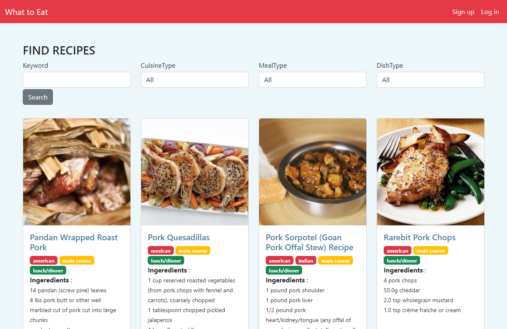
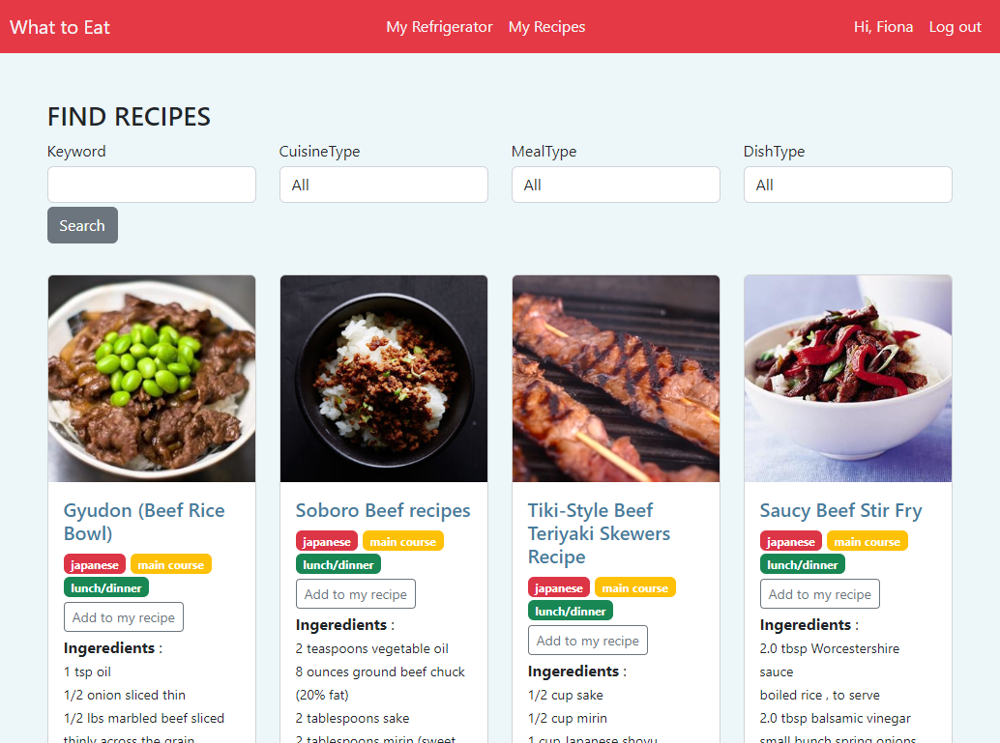
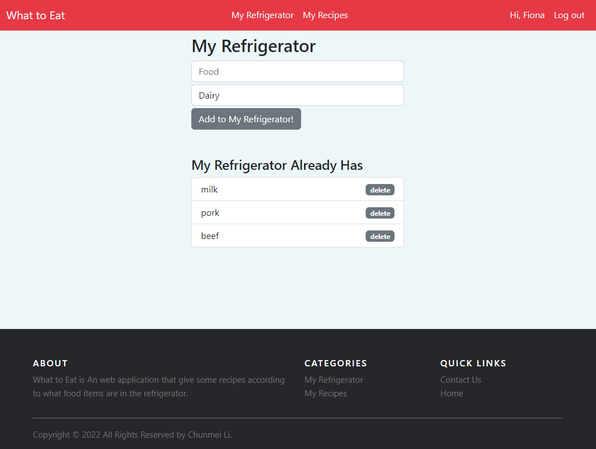
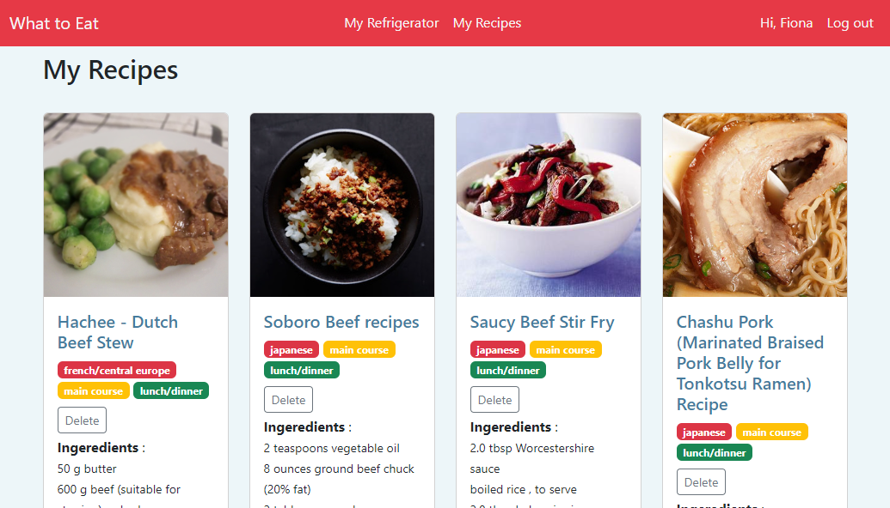
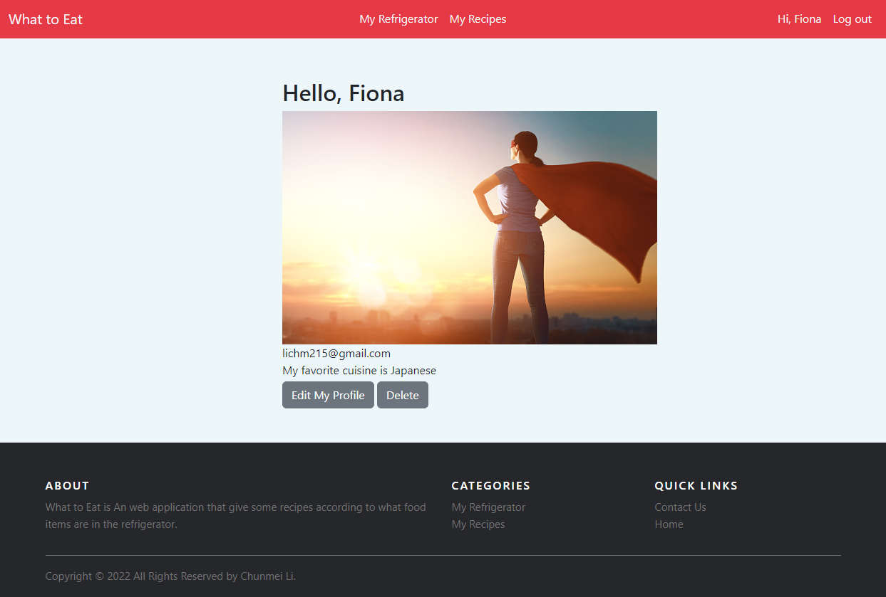

# What to Eat
This application allows user to search recipes based on filters.   
After users sign up/log in they can save liked recipes and listing food items in their refrigerator. This application gives some recipes according to what food items are in user's refrigerator and user's favorite cuisine type.

## Deployed Site

View the deployed app [What to Eat](https://what-to-eat-chunmei.herokuapp.com).

## API Selection 
 
Data will be supplied by the [edamam Recipe API](https://developer.edamam.com/edamam-recipe-api).

## Schema Design  


## Technology Stack  
- Python    
- HTML/CSS
- PostgreSQL
- Flask
- Bootstrap

## Features
- User authentication, authorization   
- Listing Food item in ```My Refrigerator```
- Add my favorite ```cuisinetype```
- Search recipes based on filters
- Save and delete liked recipes in ```My Recipes```
- List suggested recipes based on ```My Refrigerator``` and ```cuisinetype```

## User Flow
1. Landing Page(logged out home page) - includes a search bar to find recipes, ```Log in```/```Sign up``` links and some random recipes.  
  
2. User ```Sign up``` Page - let user to create personal profile/account.  
3. User ```Log in``` Page - let user to log in.  
4. After logged in home page - includes a search bar to find recipes, ```My Refrigerator```, ```My Recipes```, user profile/```Log out``` links and suggested recipes based on user's refrigerator and cuisine type.   
  
5. Search Results - lists results by default. Results will include basic information about the listing, with a link to view in detail. If authenticated, user can save listed recipes to ```My Recipes```.   
6. ```My Refrigerator``` page - allows user add some food item to ```My Refrigerator``` and displays what food items in ```My Refrigerator```  
  
7. ```My Recipes``` page - displays what recipes user saved and allow user deletes recipe from  ```My Recipes```  
   
8. User Profile - displays user profile with the ability to edit or delete.  
   
9. Footer - includes about, categories and quick links.   